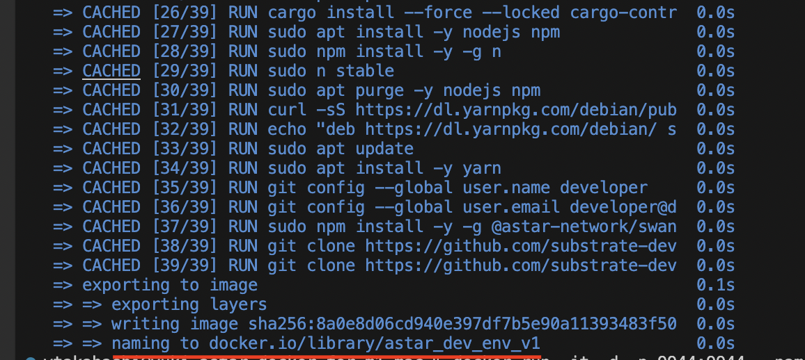

# 1 はじめに
こちらはrealtakahashiさんのgithubを元にM1 Mac用に作成しています。

https://github.com/realtakahashi/astar_docker_env?fbclid=IwAR1Eqso1--KG8qyOzQmPs5YsvKMJxyvOkPeHTS-4_P4M2jcLFjSpqCVmaIc

# 2 実施手順について

## 1 git clone

まずは、こちらをgit cloneして下さい。

```git clone https://github.com/ytakahashi2020/astar_docker_for_m1_mac.git```

## 2 imageのビルド
次に、こちらのコマンドで、imageをビルドします。
20 ~ 30分程度かかると思われます。

```cd astar_docker_for_m1_mac```

```docker build -t astar_dev_env_v1 ./.devcontainer/```




## 3 コンテナの作成と実行

下のコマンドで実行しています。

ホストのポート9944をコンテナのポート9944にマッピングしています。

```docker run -it -d -p 9944:9944 --name astar-dev astar_dev_env_v1```


## 4 ホストディレクトリとのマウントとシェルの起動

ホストのflipper_testディレクトリをコンテナ内の /app ディレクトリにマウントしています。

```docker run -it -v $(pwd)/flipper_test:/app astar_dev_env_v1 /bin/bash```


## 5 コントラクトのビルド

次のコマンドで、コントラクトをビルドしています。

```cd /app/contracts/flipper```

```cargo +nightly-2023-02-07 contract build```


## 6 デプロイ方法

これでデプロイに必要な「~.contract」ファイルが取得できました。

これを使ってデプロイを行うやり方は、こちらのnoteなどをご参照ください。

https://note.com/standenglish/n/n1459948a4088?magazine_key=m588426b7ac21


## 以下は、元のReadmeの内容です。

# Description
- This Dockerfile implements the following environment:
  - rust language
  - cargo contract
  - node.js
  - npm
  - yarn
  - swanky

# How To Use
1. Please install docker in your environment.
1. Build docker image.
1. Create a docker container.
1. Enter into the container & build a WASM smart contract.

# Command Example
```
docker image build . -t astar_dev_env_v1
docker run -it -d -p 9944:9944 --name astar-dev astar_dev_env_v1
docker exec -it astar-dev /bin/bash
```

# Example Of Starting Swanky Node
```
./swanky-node --dev --tmp --ws-external
```

# Example Of Copying the file in docker container
```
docker cp 52e781bfaa38:/home/developer/flipper/target/ink/flipper.contract ./flipper.contract
```

